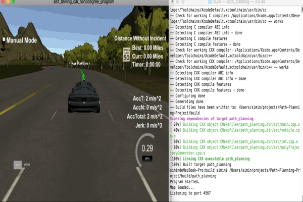

## Path-Planning-Project  --- Highway Driving

-----
### Simulator
You can download the Term3 Simulator from [here](https://github.com/udacity/self-driving-car-sim/releases).

----
### Project Overview
The goal of this project is to safely navigate around a virtual highway with other traffic that is driving +-10 MPH of the 50 MPH speed limit. The car's localization and sensor fusion data are provided, there is also a sparse map list of waypoints around the highway. The car should try to go as close as possible to the *50 MPH* speed limit, which means passing slower traffic when possible, note that other cars will try to change lanes too. The car should avoid hitting other cars at all cost as well as driving inside of the marked road lanes at all times, unless going from one lane to another. The car should be able to make one complete loop around the *6946m* highway. Since the car is trying to go 50 MPH, it should take a little over 5 minutes to complete 1 loop. Also the car should not experience total acceleration over *10 m/s^2* and jerk that is greater than *50 m/s^3*.

The highway's waypoints loop around so the frenet s value, distance along the road, goes from 0 to 6945.554. The map of the highway is in data/highway_map.txt. Each waypoint in the list contains [x,y,s,dx,dy] values. x and y are the waypoint's map coordinate position, the s value is the distance along the road to get to that waypoint in meters, the dx and dy values define the unit normal vector pointing outward of the highway loop.

The following animation shows a shot of final model navigating the car around the highway with other traffic.




### Final result with debugging output is from [YouTube Video](https://www.youtube.com/watch?v=DruJLrsjw5Q&feature=youtu.be).

## Structure
---
The project has four distinct pieces:

* **main.cpp** : Provided by Udacity to communicate with simulator,extended everything related to path planner and generating xy waypoints. Also contains pre- and post- processing steps of data and planned paths.


* **polyTrajectoryGenerator.cpp** : Everything related to evaluation of trajectories in Frenet space.


* **jmt.cpp** : JMT for generating minimum jerk trajectories.
 
 
* **vehicle.cpp** : Holds basic position, lanetype(left/mid/right),  velocity and acceleration for our controlling car and other traffic.

## States/Decision Making
---
Given us sensor fusion information, such as different speed of dynamic cars around us and how far they are in front of us or behind us(either on the left/right or on the same lane), I decided to use the following states :

* Turn Left
* Turn Right
* Keep on Lane

In the case of changing lane, clearly the lane has to be appropriate, such as the car cannot turn left on the leftmost lane, either it cannot turn right on the rightmost lane. Thus I set really large number of turning cost to punish car turning right/left under such situation. 

For computing the cost of lane changes, **distanceToClosestCar( )** , I computed gaps of the near cars(either from upper-right/bottom-right, upper-left/bottom-left or in front of us). Then I set the front-gap and behind-gap thresholds to compute lane-change-cost and weighted it larger when we are too close to the heading vehicle or when other traffic on the lower left/right is too close.

However, when our car is going straight, considering only the front distance is not enough. We have to take account into maximizing our car's speed with constraints of not exceeding speed limit and adjusting our speed when the front vehicle is going slow in order to avoid running into that car.  

Based on these three distinct states(turnleft / turnright /keeplane) at each update step, goal points are generated. And all these *start-car-state* (including our car's initial position, speed and acceleration) and *goal-car-state* (including moving decision made,such as turning left/right or going straight) will be fed into **jmt( )** function to generate jerk-minimized trajectories. These trajectories are then evaluated for feasibility. I created two cost functions **costTotalMinJerk( )** and **maxJerkCost( )** for computing the costs of **Turning Left** and **Turning Right**. 

Once the respective costs have been computed. Next, we add them together and get our best trajectory which holds the "lowest cost".

## Trajectory Generation
---
We use quintic polynomial equation to generate minimized trajectory(JMT). Following are steps on creating the car trajectory:

* Spline fit the last 15 waypoints that are closest to the current car position in relation to S for X, Y, dx, dy in Cartesian coordinates.

* Use JMT method to generate ideal trajectory for the car given the set of current and goal states(position, velocity and accleration). The state information stores in Frenet space includes s, d, velocity in s and d direction and acceleration in s and d direction. 

* Transform the trajectory to global cartesian map coordinates with X, Y axes using spline fitting from waypoints.

>To handle the latency between the simulator and the program, I created a function of **get_start( )** to get our starting trajectory and also setting our car's starting velocity as same as in the end. Then I stored our initial trajectory instead of previous waypoints from telemetry data and updated our car's state. For each cycle, I updated my path plan by appending the last path information with our generated new path.


## Reflection
---
There are two parts of this project, one is how to generate smooth trajectories that meet the minimum requirements, another one is to plan a feasible trajectory for the car to avoid other traffic and keep the car running as fast as possible without exceeding speed limit. I spent more efforts on dealing with the second part, such as how to navigate the car running fast without causing any incidents while not breaking the minimum requirements(including max acceleration limit, max jerk limit,etc.).

I found with MPC, we would be able to limit the speed and acceleration and their other variances, however, JMT method does not gurantee these and thus we have to spend more time on how to adjusting car's speed to avoid collision issue and keep acceleration constant in order to avoid jerk issue.

Also I think machine learning/deep learning technoloy would be better on making a decision. 


```python

```
